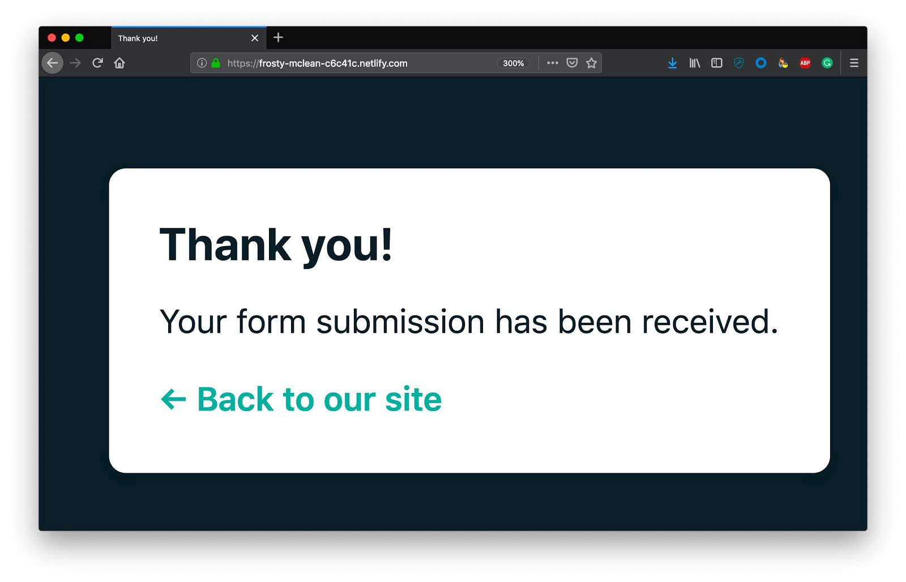
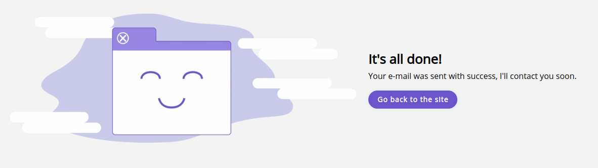

##### Contexto

<br />

Recentemente eu fiz a release de um formulário de contato no meu site, que você pode checar acessando [esse link](https://www.fabiotetsuo.com/contact) e agora
gostaria de contar como eu fiz para desenvolver essa feature, desde a criação do formulário até a integração entre Gatsby e Netlify.

<br />
<br />

##### Criando formulário base

<br />

Esse passo é bem simples e rápido, primeiro nós vamos criar um novo formulário de contato, sem inventar muito:

```jsx
import React from "react"

import Layout from "../components/Layout"
import SEO from "../components/seo"
import TextField from "../components/Input/TextField"
import TextArea from "../components/Input/TextArea"
import { Heading } from "../components/Typography"
import Button from "../components/Button"

const ContactPage = ({ data }) => {
  return (
    <Layout sidebar>
      <SEO title="Contact me!" />
      <form name="contact" method="POST">
        <Heading size={3}>Contact me!</Heading>
        <TextField
          label="What's your full name? *"
          id="name"
          type="text"
          name="name"
          helperText="Would you mind to tell your name?"
          required
        />
        <TextField
          label="E-mail *"
          id="email"
          type="email"
          name="email"
          helperText="What is your best e-mail so I can contact you?"
          required
        />
        <TextField
          label="Your website"
          id="website"
          type="text"
          name="website"
          helperText="Do you have a website?"
        />
        <TextArea
          label="Describe your project *"
          id="message"
          name="message"
          rows="8"
          helperText="Tell me more about your project, your goals and how can I help you."
          required
        />
        <Button type="submit">Submit</Button>
      </form>
    </Layout>
  )
}

export default ContactPage
```

<br />
<br />

##### Integrando com Netlify

<br />

Agora a melhor parte, como mandamos a requisição do lado do client e recebemos essa informação no Netlify?
É realmente um processo simples e que ajuda muito, pelo fato de ser rápido. Tudo que precisamos fazer é adicionar alguns atributos específicos no formulário:

```jsx
<form
  data-netlify="true"
  data-netlify-honeypot="bot-field"
  name="contact"
  method="POST"
>
  <input type="hidden" name="form-name" value="contact" />
  <Heading size={3}>
    Contact me!
  </Heading>
  <TextField
    label="What's your full name? *"
    id="name"
    type="text"
    name="name"
    helperText="Would you mind to tell your name?"
    required
  />
  /* the rest of the form... */
```

Aqui é onde a mágica acontece. Temos dois atributos novos chamados `data-netlify` e `data-netlify-honeypot` no formulário. O primeiro é responsável apenas para permitir que o Netlify comece a receber requisições desse formulário e o último é uma proteção contra spam, basicamente ele insere um campo de texto escondido que apenas bots conseguem preencher, quando esse campo esse campo for preenchido, o netlify irá recusar a requisição.
Outro ponto é que precisamos adicionar um novo input escondido, chamado `form-name` com o valor do nome do nosso formulário, isso é obrigatório para enviar dados do seu formulário para o netlify.
E por último, mas não menos importante, adicionamos o nome para cada um dos inputs, assim o payload será enviado conforme esses nomes.

Com isso, temos um formulário integrado com o netlify e se enviarmos a requisição, veremos a mensagem padrão do netlify, informando que os dados foram enviados com sucesso.



<br />
<br />

##### Adicionando um mensagem customizada

<br />

Tudo funcionou muito bem, mas e se quiseremos mostrar uma mensagem customizada com a nossa cara?
Isso também é bem simples, basta nós adicionarmos um novo atributo ao formulário chamado `action`.

```jsx
<form
  style={{ width: '100%' }}
  data-netlify="true"
  data-netlify-honeypot="bot-field"
  name="contact"
  method="POST"
  action="/contact/success"
>
```

Ele vai nos redirecionar para uma nova página, que criaremos logo em seguida com a nossa mensagem de sucesso:

```jsx
import React from "react"
import { Container, Row, Col } from "react-awesome-styled-grid"
import { graphql, Link } from "gatsby"
import Img from "gatsby-image"

import Layout from "../../components/Layout"
import SEO from "../../components/seo"
import { Heading, Body } from "../../components/Typography"
import Button from "../../components/Button"

const SuccessPage = ({ data }) => {
  const successContent = data.file.childImageSharp.fluid
  return (
    <Layout sidebar>
      <SEO title="Your submission was sent with success!" />
      <Container>
        <Row
          style={{
            marginTop: "36px",
          }}
        >
          <Col xs={4} sm={4} lg={6}>
            
          </Col>
          <Col xs={4} sm={4} lg={6}>
            <div
              style={{
                display: "flex",
                flexDirection: "column",
                justifyContent: "center",
              }}
            >
              <Heading size={3}>It's all done!</Heading>
              <Body size={1}>
                Your e-mail was sent with success, I'll contact you soon.
              </Body>
              <Link to="/">
                <Button style={{ marginTop: "16px" }}>
                  Go back to the site
                </Button>
              </Link>
            </div>
          </Col>
        </Row>
      </Container>
    </Layout>
  )
}

export const query = graphql`
  query {
    file(relativePath: { eq: "successcontent.webp" }) {
      childImageSharp {
        fluid(maxWidth: 800, quality: 100) {
          ...GatsbyImageSharpFluid_withWebp
          presentationWidth
          presentationHeight
        }
      }
    }
  }
`

export default SuccessPage
```

<br />



<br />

E é isso! Agora, temos um formulário integrado com o Netlify e uma mensagem bonita que fará com que a experência do usuário seja bem melhor!

<br />
