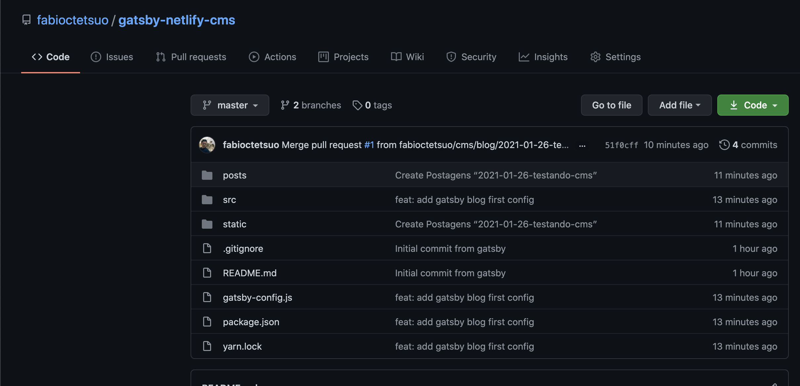

##### Contexto

Estava trabalhando durante esses dias em um projeto onde o site era totalmente estático e por isso resolvi usar o [Gatsby](https://www.gatsbyjs.com/). Durante o desenvolvimento, surgiu a demanda em que a pessoa gostaria de adicionar alguns artigos em seu site.

Porém para uma pessoa que nunca mexeu com Markdown ou Git, não seria nada fácil ficar criando ou editando um arquivo, abrir um Pull Request e checar a preview toda vez que quisesse adicionar um novo artigo. Pensando nisso resolvi utilizar o [Netlify CMS](https://www.netlifycms.org/) que é um Content Management que funciona integrado com o workflow do Git.

Ele já entrega uma interface em que a pessoa, através de um login com alguma conta do Github, consegue escrever todo o post sem depender nada de entendimento de markdown ou como funciona o pipeline do Git, tudo isso é abstraído para uma interface que controla todos esses processos.

##### Netlify CMS vs Netlify

Você provavelmente deve estar se perguntando ou pelo menos pensando "Então pra usar o Netlify CMS eu preciso necessariamente utilizar o Netlify?"

A resposta é **não**.

Para utilizar o Netlify CMS você não tem depedência nenhuma com a plataforma do Netlify. O Netlify é apenas uma plataforma que facilita o CI/CD da sua aplicação.
Porém nem toda aplicação que usa Netlify CMS usa a plataforma do Netlify. A única coisa necessária para fazer com que o CMS funcione é deixar o código dele em alguma plataforma de controle de versionamento de código, como o GitHub, Bitbucket, GitLab entre outros.

##### Adicionando arquivo de configuração

Agora que entendemos o que é necessário, vamos colocar a coisa em prática. Primeiro ponto é que precisamos criar alguns arquivos de configuração e inicialiazação do CMS.

Para esse artigo, vamos utilizar o configuração do Netlify CMS + Gatsby, porém no site oficial mostra [como configurar](https://www.netlifycms.org/docs/add-to-your-site/) para outros SSG, como o Jekyll, Hugo, Nuxt e por aí vai.

Vamos instalar a depedência do netlify cms no nosso projeto

```sh
yarn add netlify-cms-app gatsby-plugin-netlify-cms gatsby-image gatsby-transformer-sharp gatsby-plugin-sharp gatsby-remark-images gatsby-remark-relative-images

```

Vamos adicionar o Plugin do netlify a configuração do gatsby

```js
plugins: [
  "gatsby-transformer-sharp", // plugins que o gatsby image necessita para renderizar a imagem do post
  "gatsby-plugin-sharp", // plugins que o gatsby image necessita para renderizar a imagem do post
  "gatsby-plugin-netlify-cms",
]
```

Essas duas depedências são o Netlify CMS e o plugin dele para Gatsby. Esse plugin tem como função adicionar automaticamente o `admin/index.html` quando o projeto é iniciado, eliminando uma configuração a mais. Porém, caso não queira adicionar esse plugin, pode fazer a [configuração manual](https://www.netlifycms.org/docs/add-to-your-site/#app-file-structure)

Agora para adicionarmos a configuração do nosso CMS, vamos criar um novo arquivo dentro da pasta de `static/admin` chamado `config.yml`. Caso a pasta `static/admin` ainda não exista, apenas crie uma nova na raíz do projeto.

```
static
 └ admin
    └ config.yml

```

`config.yml`

```yml
backend:
  name: github # aqui definimos qual ferramente de versionamento de código usamos
  repo: githubUser/githubRepo # e.g: fabioctetsuo/fabiotetsuo.com
  branch: master # Branch que devemos atualizar (opcional, a defaul é sempre a master)
  site_domain: seusite.com.br # colocar o domínio do seu site (Sem https://www)

publish_mode: editorial_workflow # Aqui você configura se quer um interface de draft, review e aprovação do post (Esse campo funciona com o GitHub! Bitbucket e GitLab estão em Beta ainda)
media_folder: "static/assets/img" # Caminho onde devemos fazer o upload das imagens (Relativo a raíz do projeto).
public_folder: "/assets/img" # Caminho onde as imagens vão ser encontradas no site publicado
```

Essas são as configurações que precisamos fazer para que o Netlify consiga identificar o Repo e como ele deve buscar as informações. Porém precisamos configurar também as collections que é basicamente a estrutura dos nossos campos, seja ele do frontmatter ou o body.

```yml
backend:
  name: github
  repo: githubUser/githubRepo
  branch: master
  site_domain: maricavagnolli.com.br

publish_mode: editorial_workflow
media_folder: "static/assets/img"
public_folder: "/assets/img"

collections:
  - name: "blog" # Nome usado para a rota da interface do netlify (Deve ser única!) e.g., /admin/collections/blog
    label: "Postagens" # Nome que vai aparecer na interface e nos pull requests
    folder: "posts" # Onde os arquivos desse tipo estão armazenados (relativo a raíz do projeto)
    create: true # Permitir que usuários criem novos posts nessa coleção
    slug: "{{year}}-{{month}}-{{day}}-{{slug}}" # Nome que ele vai usar para criar o slug do arquivo, e.g., YYYY-MM-DD-title.md
    fields: # Campos do arquivo markdown
      - { label: "Título", name: "title", widget: "string" }
      - { label: "Descrição", name: "description", widget: "string" }
      - {
          label: "Data",
          name: "date",
          widget: "datetime",
          format: "YYYY-MM-DD hh:mm:ss",
        }
      - { label: "Imagem", name: "featuredImage", widget: "image" }
      - {
          label: "Categoria",
          name: "category",
          widget: "select",
          options: ["categoria 1", "categoria 2", "categoria 3"],
        }
      - { label: "Conteúdo", name: "body", widget: "markdown" }
```

Para conhecer mais tipos de campos, você pode acessar o seguinte link para a [documentação](https://www.netlifycms.org/docs/widgets/), ele vai mostrar todos os possíveis campos e as validações para cada um deles.

##### Adicionando novos caminhos no Gatsby Config

Com a configuração do Netlify CMS pronta, precisamos adicionar esses caminhos para que o Gatsby saiba o que buscar e onde buscar.
Vamos alterar o nosso arquivo do `gatsby-config.js`

```js
  plugins: [
    {
      resolve: `gatsby-source-filesystem`,
      options: {
        name: `uploads`,
        path: `${__dirname}/static/assets/img`, // Específicamos que o Gatsby precisa buscar os arquivos da pasta dos assets
      },
    },
    {
      resolve: `gatsby-source-filesystem`,
      options: {
        name: `posts`,
        path: `${__dirname}/posts`, // Específicamos que também precisa buscar os posts do filesystem
      },
    },
    {
      resolve: "gatsby-transformer-remark",
      options: {
        plugins: [
          {
            resolve: `gatsby-remark-relative-images`,
            options: {
              name: "uploads",
            }, // Esse plugin ajuda o markdown a buscar as imagens dentro da pasta de static, sem ele, ele não consegue pegar a imagem com o caminho relativo
          },
          {
            resolve: `gatsby-remark-images`,
            options: {
              maxWidth: 1200,
              linkImagesToOriginal: false,
            },
          },
        ], // just in case those previously mentioned remark plugins sound cool :)
      },
    },
    "gatsby-transformer-sharp",
    "gatsby-plugin-sharp",
    "gatsby-plugin-netlify-cms", // Aqui é a configuração já existente do plugin do Netlify CMS, pode ser deixada por último
  ],
```

Basicamente essa era a configuração que você precisava fazer no projeto, agora precisamos subir esse projeto para o GitHub ou sua ferramenta de versionamento preferida para aproveitarmos o workflow do Netlify CMS.



##### Acessando Administração do Netlify CMS

Com isso podemos acessar a área de Admin do nosso projeto e criar um novo post, acesse o [http://localhost:8000/admin](http://localhost:8000/admin) ou se o seu site já estiver em produção, pode acessar ele pela url do seu site + `/admin`

Ponto importante que para acessar o admin em produção, você precisa acessar o mesmo `site_domain` configurado no `config.yml` do netlify-cms e dar [autorização ao Netlify pelo Github](https://marciofrancalima.com.br/blog/netlify-cms-configurando-acesso-ao-dashboard-em-modo-produ%C3%A7%C3%A3o/)

Agora você já deve ver o CMS pronto, se você tiver algum post naquele pasta configurada em collections ele já deve aparecer disponível para você na interface também.
