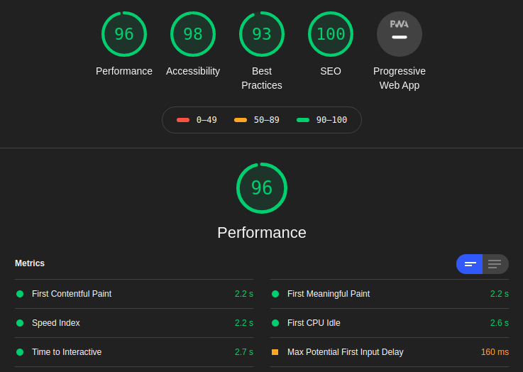

##### Introdução

<br />

Você já se encontrou em uma situação na qual entrou em algum site, começou a ler o conteúdo e uma imagem apareceu na tela do nada e te fez perder o foco do que estava lendo? Ou já presenciou alguma imagem muito grande e não otimizada que deixou o site inteiro lento?
Por um longo tempo, isso era um grande problema, porém as coisas mudaram e apareceram soluções cada vez mais modernas que nos ajudam muito, porém com algumas dificuldades.

<br />

Exemplo:

- Redimensionar imagens grandes de acordo com o design.
- Gerar imagens menores, para que o disposito movile não faça download de imagens de desktop.
- Manter a posição da imagem, para que o texto não se mova na tela após a imagem carregar.
- Criar placeholders ou efeitos de blur durante o carregamento das imagens.

<br />
<br />

##### Configurando Gatsby Image

<br />

Então, Gatsby tornou isso mais fácil com o plugin [gatsby-image](https://www.gatsbyjs.com/plugins/gatsby-image/).

Primeiro precisamos instalar algumas dependências:

```sh
yarn add gatsby-image gatsby-transformer-sharp gatsby-plugin-sharp
```

Nas configurações, vamos adicionar o plugin, o transformador e dizer para o Gatsby onde as imagens estão armazenadas

```javascript
module.exports = {
  plugins: [
    `gatsby-transformer-sharp`,
    `gatsby-plugin-sharp`,
    {
      resolve: `gatsby-source-filesystem`,
      options: {
        path: `${__dirname}/src/images/`,
      },
    },
  ],
}
```

<br />
<br />

##### Consumindo imagens com o GraphQL

<br />

Agora com as configuraçnoes realizadas, vamos combinar as informações do frontmatter com gatsby-image, retornando o caminho relativo para essa imagen em nosso markdown.

```md
---
date: 2020-01-26 06:46:23
title: Gatsby - First challenge completed
description: So, this is the first challenge of the 100 days of gatsby, and I'm really excited to tell you what I learned, the difficulties and the next steps.
category: gatsby
featuredImage: ./images/100daysofgatsby.png
---
```

Agora o GraphQL já sabe a existência das imagens, podemos fazer a query do frontmatter para retornar a imagem em nosso componente React e usar o gatsby image para renderizar o conteúdo.

```jsx
import React from "react"
import Img from "gatsby-image"
import SEO from "../components/seo"
import { Link, graphql } from "gatsby"

const IndexPage = ({ data }) => {
  const posts = data.allMarkdownRemark.edges
  return (
    <>
      <SEO title="Home" />
      {posts.map(({ node }) => (
        
      ))}
    </>
  )
}

export const query = graphql`
  query {
    allMarkdownRemark {
      edges {
        node {
          frontmatter {
            featuredImage {
              childImageSharp {
                fluid {
                  src
                }
              }
            }
          }
        }
      }
    }
  }
`

export default IndexPage
```

<br />
<br />

##### Performance

<br />

Rodando o audit no site em produção, podemos ver a performance da aplicação consumindo as imagens:


<br />

E é isso galera! Nesse breve post, configuramos o `gatsby-image`, buscamos a imagem usando o GraphQL, trabalhando com o lazy load das imagens e melhorando a performance da aplicação com uma solução simples.
